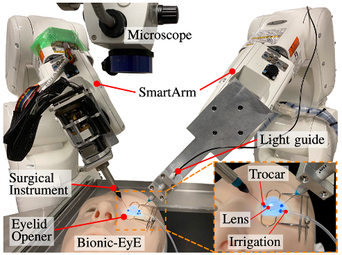
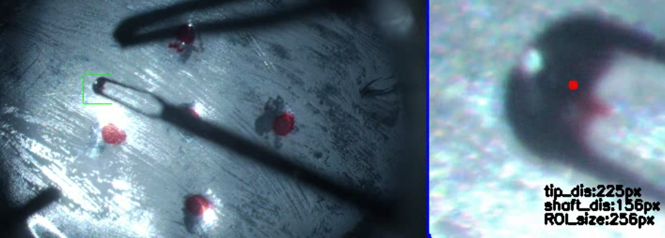

# Vitreoretinal Surgical Robot System

Teleoperated surgical robotic system to assist surgeons in the Inner Limiting Membrane (ILM) peeling task. One 6-DoF robot operates the light guide while the other 7-DoF robot operates the forceps device. Automation is integrated to increase safety, accuracy and efficiency. Automation includes the tasks of avoiding collisions between the surgical instruments and the inner wall of the eyeball, limiting the amount of eyeball rotation, and autonomous illumination control for one-handed manipulation.

**Disclaimer** This project is still under development with the latest focus on improving the keypoint detection of the robot forceps device and applying semi-automated positioning.

## Screenshots

  
  

## Technologies Used

- Language: Python, C++
- Framework: ROS, SmartArmSystem (SAS)
- Robotic Arms: Denso VS-050
- Software: CoppeliaSim
- Libraries: dqrobotics, OpenCV, PyTorch, Albumentations, matplotlib

## Usage

- For operating the robotic system, refer to the Ophthalmic Demonstration instruction manual
- To access the code that operates the robotic system, refer to the catkin_ws folder
- To create the keypoint detection model, refer to the 4k_tip_prediction folder

## Contact

For any questions or inquiries, feel free to contact me at christiantgyuen@gmail.com or https://www.linkedin.com/in/christian-yuen/.
