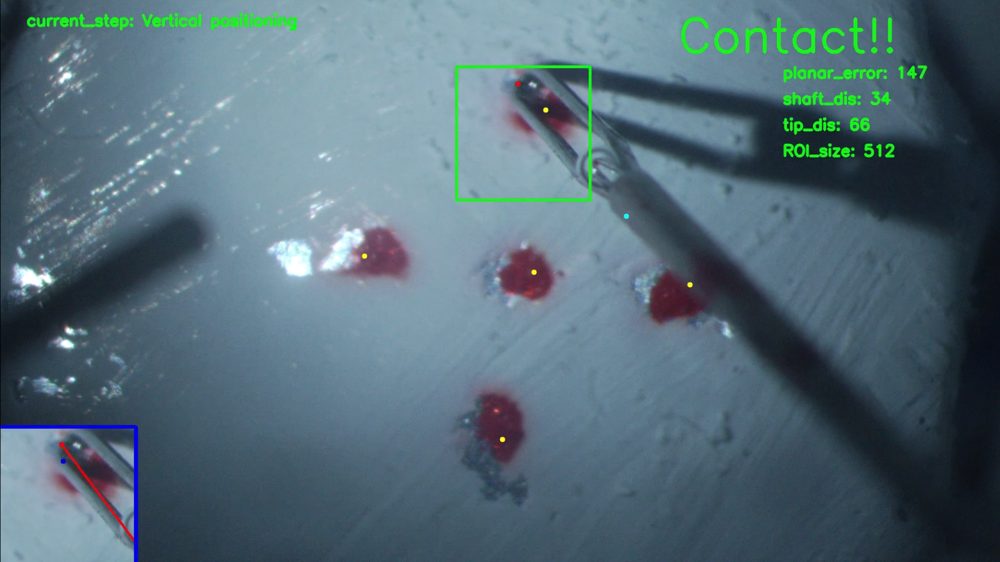
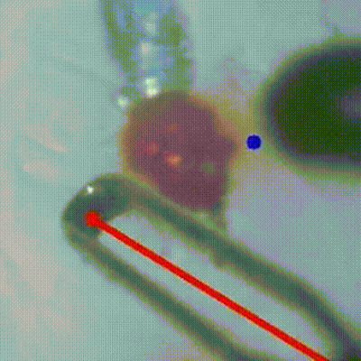

# Vitreoretinal Surgical Robot System
## Project Overview

A teleoperated surgical robotic system designed to assist surgeons in the **Inner Limiting Membrane (ILM) peeling task**, a critical step in vitreoretinal surgery. By leveraging advanced robotics and automation, the system enhances precision, safety, and efficiency, addressing the challenges associated with manual procedures.

### ILM Peeling Task by Novice - Video 📽️

## Features & Capabilities

The system comprises **two robotic arms**:  
- A **6-DoF robot** controlling the **light guide**, ensuring optimal illumination.  
- A **7-DoF robot** operating a **motorized forceps device**, providing enhanced dexterity for ILM peeling.  

### **Automation for Increased Safety & Precision**  
Several autonomous functions are integrated to assist surgeons:  
- **Collision Avoidance (VFI)**: Prevents unintended contact between surgical instruments and the inner walls of the eye.  
- **Orbital Manipulation**: Controls and limits eyeball rotation by adjusting the Remote Center of Motion (RCM).  
- **Autonomous Illumination Control**: Enables single-handed forceps manipulation by automatically adjusting the light guide position.  

### **Key Advancements from Previous Work**  
This project significantly improves upon the prior system through:  
- **Forceps Integration**: Implemented a motorized forceps device within the Vitreoretinal SmartArm System to enable precise grasping and rotational control.  
- **Enhanced Keypoint Detection**: Upgraded the shadow-based autonomous positioning framework for improved forceps detection and tracking.  
- **Refactored Framework & Codebase**: Transitioned to a modernized framework with structured, maintainable code for improved scalability and future developments.  

Further details on the system architecture, automation methods, and latest developments can be found in the **Master Thesis PDF**.  

## Setup & Usage

- **Operating the Robotic System**: Follow the instructions in the Ophthalmic Demonstration manual.
- **Robotic System Code**: The necessary scripts and configurations are located in the catkin_ws folder.
- **Keypoint Detection Model**: The model development and training resources can be found in the 4k_tip_prediction folder.

## Methodology  

- **Languages**: Python, C++  
- **Framework**: ROS, SmartArmSystem (SAS)  
- **Robotic Arms**: Denso VS-050  
- **Software**: CoppeliaSim  
- **Libraries**: dqrobotics, OpenCV, PyTorch, Albumentations, matplotlib, OpenMP  

### Hardware Setup  

The system consists of three main components:  
- **Patient side**: Two robotic manipulators, Bionic-Eye model, and a microscope-camera.  
- **Computing infrastructure**: Three computers handling **image processing, kinematics, and forceps control**.  
- **Operator side**: A Windows PC with **haptic devices and a clutch** for teleoperation, with a monitor displaying the workspace.  

  

### Software Setup  

The **central control computer** (green) contains ROS nodes for **kinematics and autonomous positioning**. The **image processing computer** (red) detects keypoints, while the **forceps computer** controls the device and communicates with the system.  

### Image Processing  

A **dual-neural network (NN) approach** enhances keypoint detection:  
- **Main NN** detects the forceps tip and shadow tip.  
- **ROI NN** determines the ROI center and shaft keypoint for greater stability.  

Both NNs were trained on **1,000 labeled images, augmented to 6,000**, using a **ResNet-18 encoder pretrained on ImageNet**.  

The **image processing node** extracts keypoints, computes positioning errors, and relays them to the **autonomous positioning program**, which calculates kinematic solutions. **Moving averages, outlier filters, and parallel processing** improve speed and reliability.  

The autonomous positioning program integrates **orbital manipulation kinematics and supports both simulation and real robots** for efficient error testing. Code refactoring, including **helper functions, controller classes, and a sliding window technique**, enhances performance, maintainability, and positioning accuracy.

## Experimental Results  

The experiment consisted of **12 trials**, with **4 successful** (Trials 2, 3, 11, and 12), resulting in a **33% success rate**. The remaining **8 trials were aborted** due to excessive force on the fundus during vertical positioning. The system successfully positioned at **10 out of 34 target points (30%)**, with an **average task duration of 385 seconds**.  

Box-and-whisker plots visualize key performance metrics. The left plot shows **additional positioning distances**, averaging **183 µm** with **low deviation (5.1 µm)**, indicating consistency.  

The right plot illustrates **positioning error**, averaging **904 µm**. Accuracy was highest at the **workspace center (p3)** but declined at peripheral targets due to image processing limitations.  

Positioning success correlated with additional distance. **p2, with no successful trials, had the highest additional positioning (192 µm), while p4, with an 80% success rate, had the lowest (175 µm).** These findings suggest shorter additional distances improve success rates.  

### Qualitative Observations  

<table>
  <tr>
    <td align="center">
      <figure>
        
        <figcaption><b>Vertical positioning errors</b>: Led to premature termination.</figcaption>
      </figure>
    </td>
    <td align="center">
      <figure>
        
        <figcaption><b>Overlap positioning issues</b>: Caused detection failures at p2.</figcaption>
      </figure>
    </td>
    <td align="center">
      <figure>
        
        <figcaption><b>Bubbles and fundus wear</b>: Formed due to conductivity and accumulated over trials respecively.</figcaption>
      </figure>
    </td>
  </tr>
  <tr>
    <td align="center">
      <figure>
        
        <figcaption><b>Excessive force</b>: From misdetections led to trial aborts.</figcaption>
      </figure>
    </td>
    <td align="center">
      <figure>
        
        <figcaption><b>Sudden movements</b>: Caused by RCM misalignment.</figcaption>
      </figure>
    </td>
    <td align="center">
      <figure>
        
        <figcaption><b>Shadow occlusion</b>: Impaired detection, especially at p5.</figcaption>
  </tr>
</table>

### Comparison with Needle-Based Study  
- **Higher success rate for needle** due to simpler geometry and more robust keypoint detection.  
- **Needle applied 49 mN force**, while forceps likely exerted more.  
- **Forceps had better additional positioning accuracy but higher planar error.**  
- **Forceps overshot targets, increasing task duration.**  

These results highlight areas for improvement, including dataset expansion for enhanced detection.  

## Demonstration Videos 📽️

### Shadow-Based Autonomous Positioning Trial with Forceps

### Shadow-Based Autonomous Positioning Trial in Simulation

 
## Application & Future Work

The autonomous positioning system has been successfully implemented in both R&D contact detection trials and real ILM Bionic-Eye models. To enhance robustness and versatility, several key advancements are planned:

The following future work is required for a more robust and versitile system:
- **ILM Peeling Experiment**: Validate the feasibility of ILM peeling using the Vitreoretinal SmartArm System.
- **Forceps Rotation Alignment**: Develop a method ensuring both ends of the forceps contact the fundus simultaneously, minimizing excessive force on the retina.
- **Improved Forceps Design**: Implement a forceps variant without a central hole and with variable open positioning to enhance image detection and ILM peeling capabilities.
- **Advanced Image Processing**: Integrate amodal segmentation and improved keypoint detection to better predict occluded shadows caused by the forceps.
- **System Optimizations**: Upgrade hardware and optimize software for improved performance, efficiency, and reliability.

These enhancements aim to refine autonomous positioning, improve surgical precision, and expand the system’s capabilities for real-world applications.

## Contact

For any questions or inquiries, feel free to contact me at christiantgyuen@gmail.com or https://www.linkedin.com/in/christian-yuen/.
